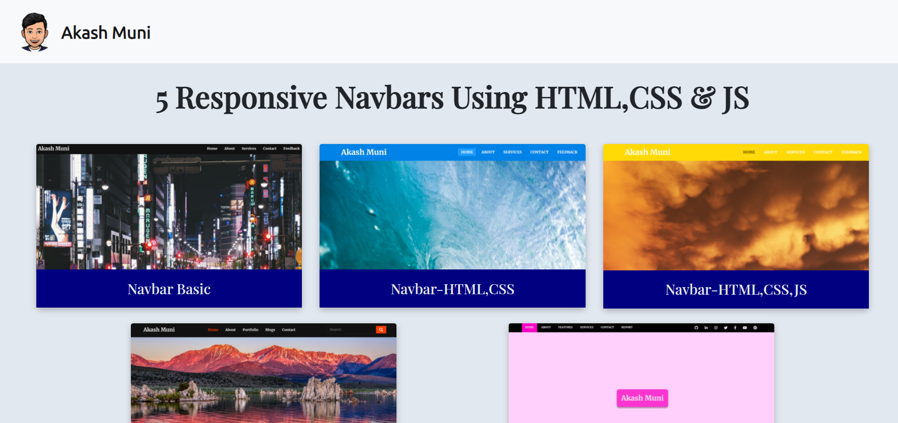

<h1>5 Responsive Navbars Using HTML, CSS & JS</h1>

<h2>All the Navbars are built using HTML, CSS & JavaScript.</h2>

<h3>You can find the projects <a href="https://5-responsive-navbars-using-html-css-js.netlify.app/" target="_blank">here<a>.</h3>

<ol>
<li>Nav-Bar-Basic</li>
<li>Nav-Bar-HTML-CSS</li>
<li>Nav-Bar-HTML-CSS-JS</li>
<li>Auto-Write-Text</li>
<li>Nav-Bar-With-Search</li>
<li>Nav-Bar-With-Social-Share</li>
</ol>

<h3>Happy Coding!</h3>
